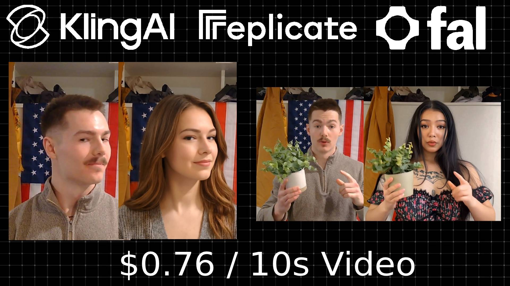

<h1 align="center">Swap Studio - Save money and use the direct API</h1>

<p align="center">
  
</p>

<p align="center">
  <a href="https://x.com/RomanSlack1/status/2016750144436523218" style="cursor: pointer;">
    
  </a>
</p>

AI-powered character transformation using motion capture and video synthesis. Record yourself or upload a video, provide a character image, and watch AI replace you with that character - preserving your exact movements, gestures, and timing.

## Features

### Three Transformation Modes

- **Character Swap** - Replace yourself in a video with any character image while preserving movements and scene context
- **Motion Control** - Animate a static character image using motion from a reference video
- **Lip Sync** - Synchronize video mouth movements to match provided audio

### Core Capabilities

- **Webcam Recording** - Record directly from your browser (3-30 seconds)
- **Video Upload** - Or upload an existing video file
- **Drag & Drop** - Easy file upload with drag and drop support
- **Character Image Upload** - Any clear image of the character you want to become
- **Real-time Progress** - Live updates as your video is processed
- **Quality Options** - Standard or Pro mode for different quality/cost tradeoffs
- **Video Compression** - Automatic FFmpeg compression for optimal API uploads

## Tech Stack

- **Frontend**: Next.js 15, React 19, TypeScript
- **Backend**: Python FastAPI, Uvicorn
- **AI Providers**:
  - fal.ai (Kling O1 Edit, Kling LipSync)
  - Kling Direct API
  - Replicate (Kling v2.6 wrapper)
- **Video Processing**: FFmpeg

## Quick Start

### 1. Get API Credentials

You'll need at least one of these:

- **fal.ai** (Recommended) - Sign up at [fal.ai](https://fal.ai) for Character Swap and Lip Sync
- **Replicate** - Sign up at [replicate.com](https://replicate.com) for Motion Control
- **Kling Direct API** - Apply at [klingai.com/dev](https://klingai.com/global/dev) (requires business approval for longer videos)

### 2. Backend Setup

```bash
cd backend

# Create virtual environment
python -m venv venv
source venv/bin/activate  # On Windows: venv\Scripts\activate

# Install dependencies
pip install -r requirements.txt

# Configure environment
cp .env.example .env
# Edit .env and add your API keys (see Environment Variables below)

# Run the server
uvicorn main:app --reload --port 8000
```

### 3. Frontend Setup

```bash
cd frontend

# Install dependencies
npm install

# Configure environment (optional)
cp .env.local.example .env.local

# Run dev server
npm run dev
```

### 4. Open the App

Navigate to [http://localhost:3000](http://localhost:3000)

## Environment Variables

### Backend (.env)

```bash
# fal.ai - For Character Swap and Lip Sync
FAL_API_KEY=your_fal_api_key

# Replicate - For Motion Control
REPLICATE_API_TOKEN=your_replicate_token

# Kling Direct API (optional - requires business approval)
KLING_ACCESS_KEY=your_kling_access_key
KLING_SECRET_KEY=your_kling_secret_key
KLING_API_BASE=https://api.klingai.com  # Optional override
```

### Frontend (.env.local)

```bash
NEXT_PUBLIC_API_URL=http://localhost:8000
```

## Usage

### Character Swap
1. Select "Character Swap" mode
2. Record or upload a video of yourself (3-30 seconds)
3. Upload a character image with clear face/body visible
4. Click Generate and wait for processing

### Motion Control
1. Select "Motion Control" mode
2. Upload a motion reference video
3. Upload a character image to animate
4. Optionally add a prompt describing the desired motion
5. Click Generate

### Lip Sync
1. Select "Lip Sync" mode
2. Upload a video (2-60 seconds)
3. Upload an audio file
4. Click Generate to sync the mouth movements to the audio

## Pricing

Costs vary by provider and mode:

| Mode | Provider | Cost |
|------|----------|------|
| Character Swap | fal.ai | ~$0.21 per 5-second video |
| Motion Control | Replicate | ~$0.07 per second |
| Motion Control | Kling Direct | ~$0.21 per 5-second video |
| Lip Sync | fal.ai | ~$0.17 per minute |

Pro mode is available for higher quality at increased cost.

## Project Structure

```
Swap_Studio/
├── frontend/                 # Next.js 15 app
│   ├── app/
│   │   ├── page.tsx          # Main UI component
│   │   ├── layout.tsx        # Root layout
│   │   └── globals.css       # Styling
│   ├── public/               # Static assets
│   └── package.json
├── backend/                  # FastAPI server
│   ├── main.py               # API endpoints & AI integrations
│   ├── requirements.txt
│   └── .env.example
└── README.md
```

## API Endpoints

| Method | Endpoint | Description |
|--------|----------|-------------|
| POST | `/api/swap` | Start a character swap or motion control job |
| GET | `/api/swap/{job_id}` | Get job status and progress |
| DELETE | `/api/swap/{job_id}` | Cancel a job |
| POST | `/api/lipsync` | Start a lip sync job |
| GET | `/api/lipsync/{job_id}` | Get lip sync job status |
| GET | `/health` | Health check with API configuration status |

## Video Duration Limits

- **Standard (Replicate)**: Up to 10 seconds per generation
- **Kling Direct API**: Up to 30 seconds (requires business approval)
- **Quality Notes**:
  - 0-30s: Consistent quality
  - 30-60s: Subtle drift in lighting/character
  - 60s+: Noticeable degradation

## Requirements

- Python 3.8+
- Node.js 18+
- FFmpeg (for video compression)

## Resources

- [fal.ai Documentation](https://fal.ai/docs)
- [Replicate Documentation](https://replicate.com/docs)
- [Kling Developer Portal](https://klingai.com/global/dev)
- [Kling API Documentation](https://app.klingai.com/global/dev/document-api/quickStart/productIntroduction/overview)
- [Next.js Docs](https://nextjs.org/docs)
